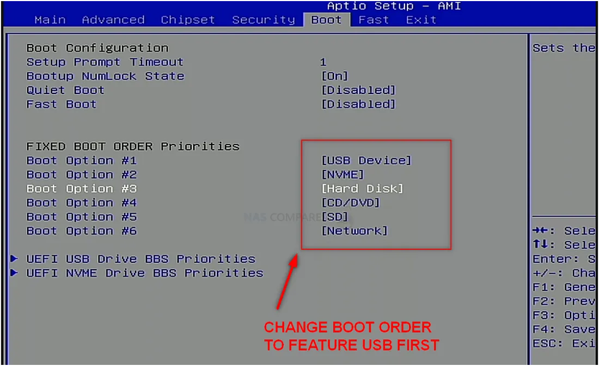
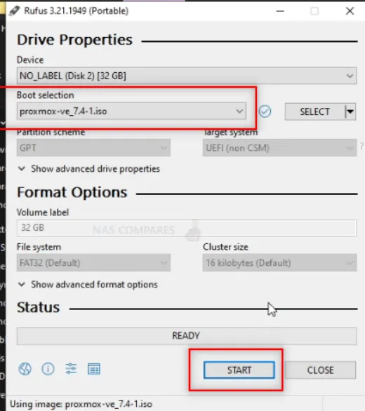
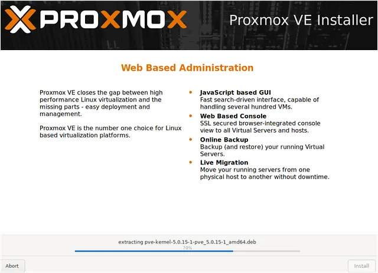
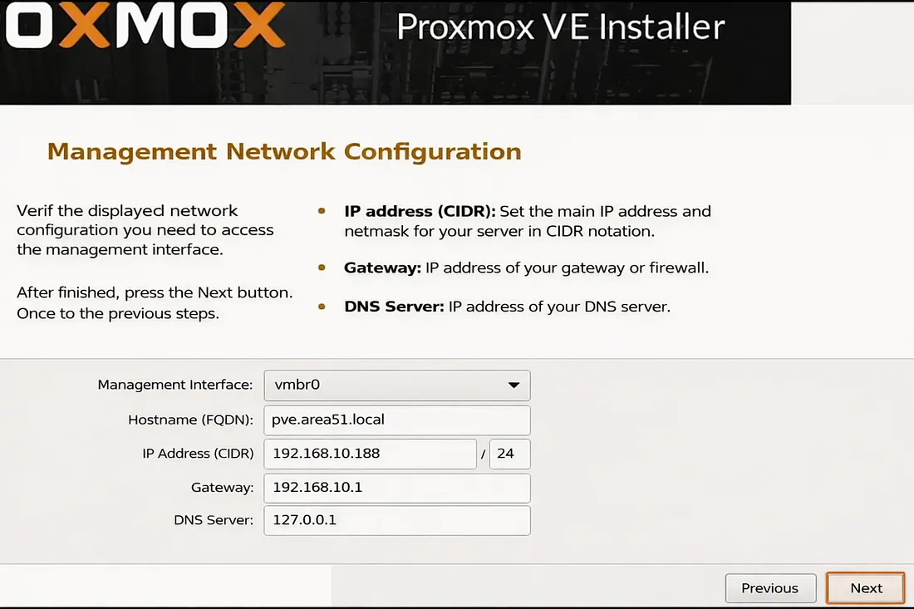
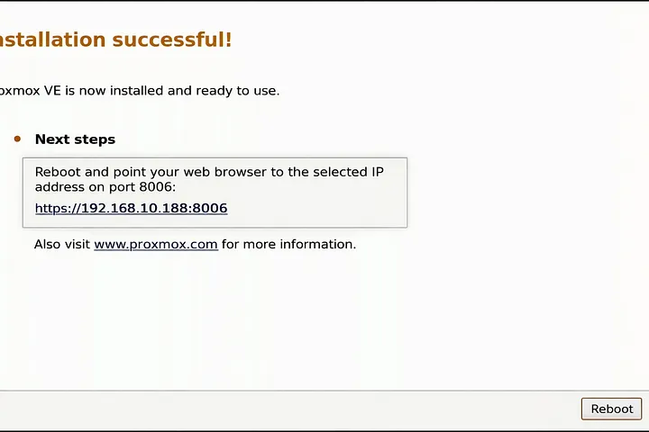
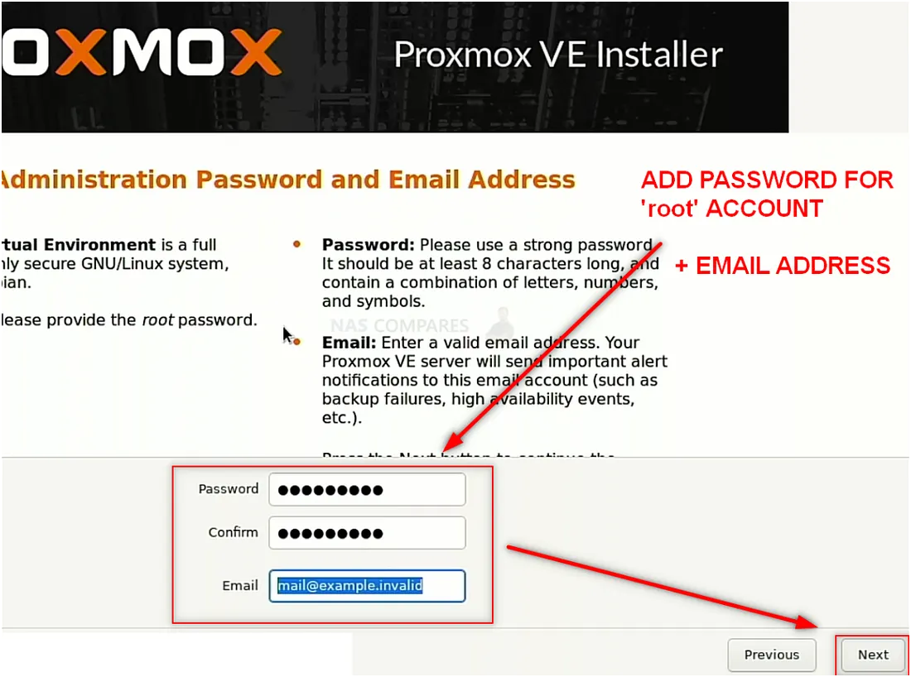

# Phase 1 – Bare-Metal Infrastructure Setup

## Overview
This phase documents the initial setup of a bare-metal virtualization environment using Proxmox VE.  
The objective was to prepare physical hardware, deploy a Type-1 hypervisor, configure management networking, and establish remote administrative access.

This approach was chosen to simulate real-world infrastructure deployment rather than relying on desktop virtualization tools.---

---

## Lab Environment

- **Host Machine:** Dell OptiPlex 3050  
- **Hypervisor:** Proxmox VE  
- **Hostname:** pve.area51.local  
- **Management IP:** 192.168.10.188/24  
- **Gateway:** 192.168.10.1  

---

## Scope of Work

---

### 1. BIOS Boot Configuration

The system BIOS was configured to allow booting from external installation media.

This step ensures the system can load the Proxmox installer from a USB device, which is a common requirement during OS deployment.

---

### 2. Bootable USB Creation

A bootable Proxmox installation drive was created using Rufus.

This process involved flashing the Proxmox ISO image to a USB device, enabling the system to perform a bare-metal installation.

---

### 3. Proxmox Installation Process

The system was booted from the USB drive and the Proxmox installation process was initiated.

This stage included selecting installation options and confirming system configuration before deployment.

---

### 4. Network Configuration

During installation, a static IP address was assigned to the Proxmox management interface.

Configuration used:
- IP Address: 192.168.10.188/24  
- Gateway: 192.168.10.1  
- Hostname: pve.area51.local  
- DNS Server: 127.0.0.1  

This ensures consistent access to the hypervisor across the network.

---

### 5. Installation Completion

The installation process completed successfully, confirming that Proxmox was ready for use.

At this stage, the system provided the URL required to access the management interface.

---

### 6. Web Interface Access

The Proxmox web interface was accessed using a browser over port 8006.

After logging in, the dashboard was verified.

This confirms that the hypervisor is fully operational and ready for virtual machine deployment.

---

## Result

At the end of Phase 1:

- Proxmox VE successfully deployed on bare-metal hardware  
- Static management networking configured  
- Remote access to the hypervisor confirmed  
- System ready for virtual machine provisioning  

---

## Skills Demonstrated

- Bare-metal OS installation  
- BIOS/UEFI configuration  
- Bootable media creation  
- Static IP addressing  
- Network configuration fundamentals  
- Remote system administration  

---

## Next Phase

Phase 2 will focus on deploying and configuring:

- Windows Server (Active Directory)
- Domain services
- Client systems for user simulation